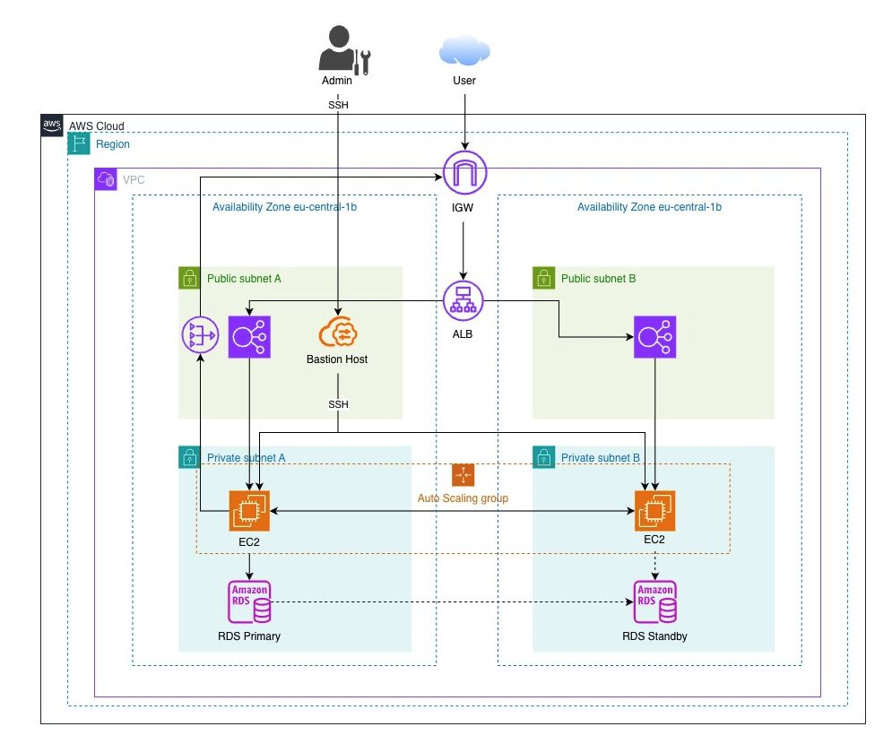

# 🏗️ AWS 3-Tier Web Application Architecture

> Production-ready, highly available 3-tier infrastructure on AWS — deployed across 2 Availability Zones with Auto Scaling, RDS Multi-AZ, and defense-in-depth security. Region: eu-central-1 (Frankfurt)

---

## Architecture Diagram



---

## Overview

A fully functional 3-tier architecture built from scratch on AWS, demonstrating high availability, scalability, and security best practices. The infrastructure spans two Availability Zones and implements a layered security model with public and private subnets.

| Tier | Component | Details |
|---|---|---|
| **Presentation** | Application Load Balancer | Public-facing, spans 2 AZs |
| **Application** | EC2 Auto Scaling Group | Private subnets, t3.micro instances |
| **Data** | RDS MySQL Multi-AZ | Primary (AZ-1) + Standby (AZ-2) |

---

## AWS Services Used

| Service | Role |
|---|---|
| **VPC** | Isolated network with public/private subnets across 2 AZs |
| **Internet Gateway (IGW)** | Entry point for inbound internet traffic |
| **Application Load Balancer (ALB)** | Distributes traffic across EC2 instances |
| **EC2 Auto Scaling Group** | Automatically scales application servers based on demand |
| **NAT Gateway** | Allows private EC2 instances to reach the internet (outbound only) |
| **Bastion Host** | Secure SSH access point for administration |
| **Amazon RDS MySQL (Multi-AZ)** | Managed database with automatic failover to standby |
| **Security Groups** | Stateful firewalls controlling inter-tier traffic |

---

## Network Design

```
AWS Cloud — eu-central-1
└── VPC
    ├── Availability Zone eu-central-1a
    │   ├── Public Subnet A
    │   │   ├── ALB node
    │   │   └── Bastion Host
    │   └── Private Subnet A
    │       ├── EC2 (Auto Scaling)
    │       └── RDS Primary
    │
    └── Availability Zone eu-central-1b
        ├── Public Subnet B
        │   └── ALB node
        └── Private Subnet B
            ├── EC2 (Auto Scaling)
            └── RDS Standby
```

**Traffic flow:**
- User → IGW → ALB → EC2 (private subnet) → RDS Primary
- Admin → Bastion Host public IP (IGW routes into VPC) → SSH → EC2 (private subnet)
- EC2 outbound → NAT Gateway → IGW → Internet

---

## Security Implementation

4 dedicated Security Groups — each tier only communicates with adjacent tiers:

| Security Group | Inbound Rules | Purpose |
|---|---|---|
| **SG-ALB** | 0.0.0.0/0 on port 80/443 | Accept public web traffic |
| **SG-Bastion** | Admin IP on port 22 | Restrict SSH to known IP only |
| **SG-EC2** | SG-ALB on port 80, SG-Bastion on port 22 | App servers only reachable from ALB or Bastion |
| **SG-RDS** | SG-EC2 on port 3306 | Database only reachable from app tier |

Key security decisions:
- **No public IPs** on EC2 application servers
- **Security group references** instead of hardcoded IP ranges
- **Private subnets** for both application and data tiers
- **Bastion Host** as the only SSH entry point

---

## ⚠️ Key Design Decision — Subnet Consolidation

EC2 and RDS intentionally share the same private subnets rather than using separate application and data subnets.

**Why:**
- Simplified networking — fewer route tables to manage
- Reduced cost — single NAT Gateway instead of multiple
- Faster troubleshooting for a learning environment
- Security Groups provide sufficient logical isolation for this use case

**Production note:** In a production environment, EC2 and RDS would be placed in dedicated, separate subnets following AWS best practices for strict tier isolation.

---

## Technical Challenges Solved

**NAT Gateway routing causing 502 errors**
Private route tables were missing the NAT Gateway route. EC2 instances couldn't reach the internet for package installs, causing the ALB health checks to fail. Fixed by explicitly adding `0.0.0.0/0 → NAT Gateway` to each private route table.

**Security group inter-tier communication**
Rather than using IP CIDR blocks (which change with scaling), all security group rules use security group references — e.g. SG-EC2 allows inbound from SG-ALB, not from a specific IP. This ensures rules remain valid as instances scale in/out.

**Automated server provisioning**
Used EC2 user data scripts to automatically install and configure the web server on every new instance launched by the Auto Scaling Group — ensuring consistent, repeatable deployments without manual SSH intervention.

---

## Cost Optimization (Dev Environment)

| Decision | Monthly Saving |
|---|---|
| Single NAT Gateway (vs. one per AZ) | ~$45/month |
| t3.micro instances (burstable) | Minimizes EC2 cost |
| db.t3.micro RDS instance | Minimizes RDS cost |

**Estimated total cost:** ~$50–70/month (dev environment with minimal traffic)

**Production recommendation:** Use one NAT Gateway per AZ for true high availability — the $45/month saving is not worth the risk in production.

---

## Key Learnings

- Multi-AZ deployment is essential for production — single AZ means a single point of failure
- NAT Gateway routes must be explicitly added to private route tables — they are not automatic
- ALB automatically spans multiple AZs and handles failover — no manual configuration needed
- User data scripts ensure every Auto Scaling launch is identical — critical for consistency

---


## 👤 Author

**Anis Hasni** — AWS Certified Cloud Practitioner & Solutions Architect Associate
Transitioning from Automotive T&V Engineering to Cloud Infrastructure
[LinkedIn](https://www.linkedin.com/in/hasnianis) · [GitHub](https://github.com/anhasni) · [Credly](https://www.credly.com/users/anishasni)
